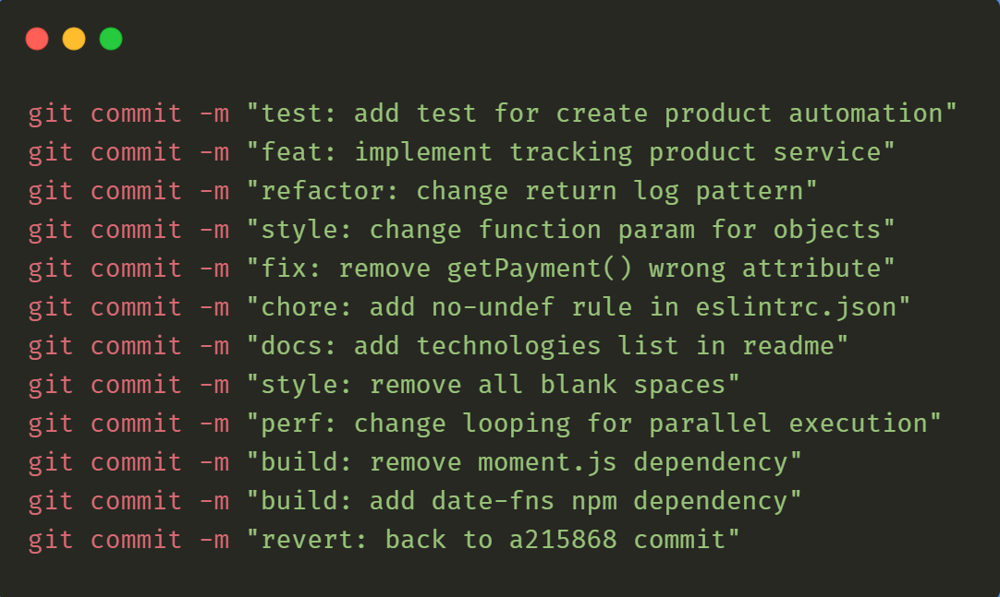

## __List of tools used in this post__

* [commitizen](https://commitizen-tools.github.io/commitizen/#:~:text=Commitizen%20is%20a%20tool%20designed,and%20enforces%20writing%20descriptive%20commits.)
* [conventionalcommits](https://www.conventionalcommits.org/en/v1.0.0/)
* [Git Hooks](https://git-scm.com/book/en/v2/Customizing-Git-Git-Hooks)
* [Pre-commit hook](https://pre-commit.com/)
* [GitHub Action](https://github.com/features/actions)
* [Semantic Versioning](https://semver.org/)

Here is a [sample repository](https://github.com/pandalearnstocode/minimal_library_workflow) which show the implementation below.


## __Context & overview__

Lets assume that we are going to build a python library. Lets call it `minipackage`. We need to manage the version of the library & need to generate the `CHANGELOGS.md` whenever we release a version of the library. There are multiple ways to solve this problem. Here in the post we are going see how we can use semantic versioning to solve this problem. 

## __Project directory structure__

* `minipackage`: All the source code for the python library will live here.
  * `__init.py__`: Library version, other meta data will be here. Also, we need to register any external methods we want to expose as API in the library.
  * `main.py`: main module is kind of representation of any module and sub-module which will be part of the python library. 
* `pyproject.toml`: This file will have all the meta-data related to the tools which we will be using this project. In the example, `tool.commitizen` example is present but there can be many more settings registered in this file related to the other tools being used in the project. 
* `README.md`: self explanatory.
* `requirements.txt`: All the python dependencies required for the library.
* `.pre-commit-config.yaml`: git pre-commit hooks. Here in this example we have just shown the `commitizen` pre-commit hook example. But there can be many other as well.
* `setup.py`: all the library building related information will be here.


If you want to refresh some basics of python library building process checkout this [link](https://www.youtube.com/watch?v=P3dY3uDmnkU). Regarding [pre-commit](https://www.youtube.com/watch?v=Wmw-VGSjSNg) checkout this link.


```bash
.
├── minipackage
│   ├── __init__.py
│   ├── main.py
├── pyproject.toml
├── README.md
├── requirements.txt
├── .pre-commit-config.yaml
└── setup.py
```

### __`pyproject.toml`: project tools and metadata related to tools used in project__

`version` and `version_files` these are the two import field which has a major impact in this workflow. make sure that `version_files` field points to the file which is the single source of version. We also need to ensure that we will be using the same file and variable all across the project. While start a project `__version__` in `__init__.py` and `version` variable in `pyproject.toml` file should match.


```toml
[tool.commitizen]
name = "cz_conventional_commits"
version = "0.0.1"
version_files = [
    "minipackage/__init__.py",
    "pyproject.toml:version"
]
tag_format = "v$version"
bump_message = "bump: $current_version → $new_version [skip-ci]"
```

Note, here in our example here we using the variable `__version__` in all place in the project to manage the version and the same file is mentioned in the pyproject file. Now, when we using `commitizen` to bump version of the library it will change value of this variable depending on the commit message tags. Also, this will generate a `changelog.md` file in the project root directory and create a release tag.

### __`setup.py`: library build related information__

In this section, notice that we using `__version__` variable from `minipackage` module here. We are passing this `__version__` variable to in `version` argument in setup function. This will ensure whenever we are building a library, the library gets tagged with this version.

Note, that whatever is being defined or imported in `minipackage/__init__py` file will be present in in `minipackage` module.

```python
from setuptools import find_packages, setup
from minipackage import __version__

setup(
    author="Aritra Biswas",
    author_email="pandalearnstocode@gmail.com",
    python_requires=">=3.8",
    install_requires=requirements,
    include_package_data=True,
    keywords="minipackage",
    name="minipackage",
    packages=find_packages(include=["minipackage", "minipackage.*"]),
    version=__version__,
)
```


### __`source/__init__.py`: main place where the version variable is being used__

This will be the initial state of the init file. Later when we bump library version in the CI pipeline, this `__version__` variable will change depending upon commit message tags.

```python
__version__ = "0.0.1"
from minipackage.main import hello_world, hello_mcu, hello_dc, 
```





### __`.pre-commit-config.yaml` : ensuring commit message format is being followed__

This is not a mandatory thing but kind of a fail safe mechanism to implement conventional commit messages in our day to day workflow.

```yaml
repos:
- repo: https://github.com/commitizen-tools/commitizen
  rev: v2.19.0
  hooks:
    - id: commitizen
      stages: [commit-msg]
```

One this pre-commit hook is install to a repository, whenever we are going to make commit this will check the commit tags are present in the commit message or not. To know more about this in depth go through this [site](https://www.conventionalcommits.org/en/v1.0.0/).


### __`.github/workflows/bumpversion.yaml` : GitHub action to update the version value in the respective file__

For a commit message like `bump: update library version.` to the configured branch, this will update the library version, generate changelog and push it to the feature branch. Post that when we trigger a build, a library with the same version tag will be generated and sent to the python library repository.

```yaml
name: NEW Bump version
on:
  push:
    branches:
      - develop
jobs:
  bump_version:
    if: "!startsWith(github.event.head_commit.message, 'bump:')"
    runs-on: ubuntu-latest
    name: "Bump version and create changelog with commitizen"
    steps:
      - name: Check out
        uses: actions/checkout@v2
        with:
          fetch-depth: 0
          token: "${{ secrets.GITHUB_TOKEN }}"
      - id: cz
        name: Create bump and changelog
        uses: commitizen-tools/commitizen-action@master
        with:
          github_token: ${{ secrets.GITHUB_TOKEN }}
          branch: develop
      - name: Print Version
        run: echo "Bumped to version ${{ steps.cz.outputs.version }}"
```

__Note:__ This workflow may change depending upon how you want to update the library version. Here action is driven by push to develop branch but it is possible to setup this process with pull request trigger or any other trigger as well.

### __Reference:__

* [Conventional Commits Pattern](https://en.linkapi.solutions/blog/conventional-commits-pattern)
