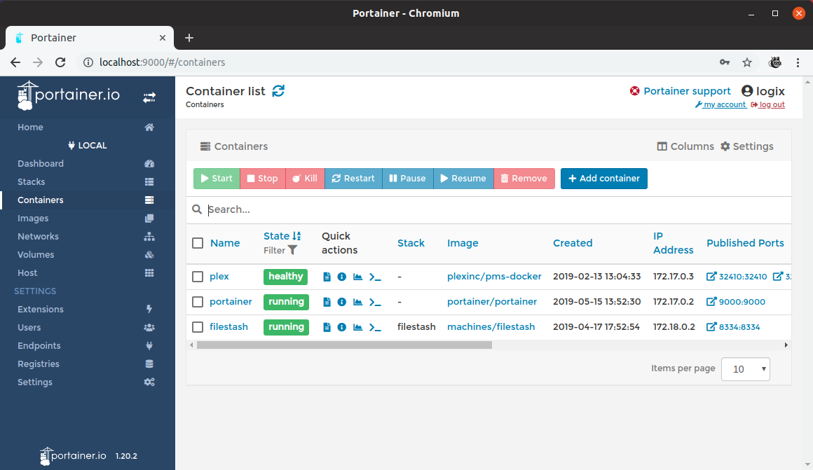

In this post I'm going to discuss two docker tools which I find really useful in my day to day workflow. These tools are,

* [Dive](https://github.com/wagoodman/dive)
* [Portainer](https://portainer.io/)
* [dozzle](https://dozzle.dev/)

## Dive: quick check of docker images


Dive is super useful to check if there any unnecessary data stored in a docker image. In Ubuntu to install dive run the following commands,

```bash
wget https://github.com/wagoodman/dive/releases/download/v0.9.2/dive_0.9.2_linux_amd64.deb
sudo apt install ./dive_0.9.2_linux_amd64.deb
```

Note, replace this `0.9.2` version to the latest one. Once this tool is installed in your system you can use,

```bash
dive <your-image-tag>
```

or

```bash
dive build -t <some-tag> .
```

You can use dive as GitHub action in your workflow. Checkout [this](https://github.com/marketplace/actions/dive-action) action which helps integrating dive in your workflow using github action.

## Dozzle: a light-weight centralized log monitoring tool for containers


This an useful tool which can be used for monitoring all the running containers live logs. This can be used with normal docker-compose or docker swarm.


```bash
dozzle:
  container_name: dozzle
  image: amir20/dozzle:latest
  volumes:
    - /var/run/docker.sock:/var/run/docker.sock
  ports:
    - "8001:8080"
```

If you add the above section in any of the existing docker-compose file this will work out of the box and will show all the running logs of the same docker compose file in `localhost:8001`.


## Portainer: GUI to monitor all running container

This tool is good to see all the all docker containers in the system and meta data related to the docker containers.



Portainer 2.0 out of the box works with,

* docker
* docker-compose
* docker-swarm
* kubernetes
* azure container registry


## Reference:

* https://www.youtube.com/watch?v=QBNaOdNSsx8
* https://github.com/amir20/dozzle
* https://docs.portainer.io/